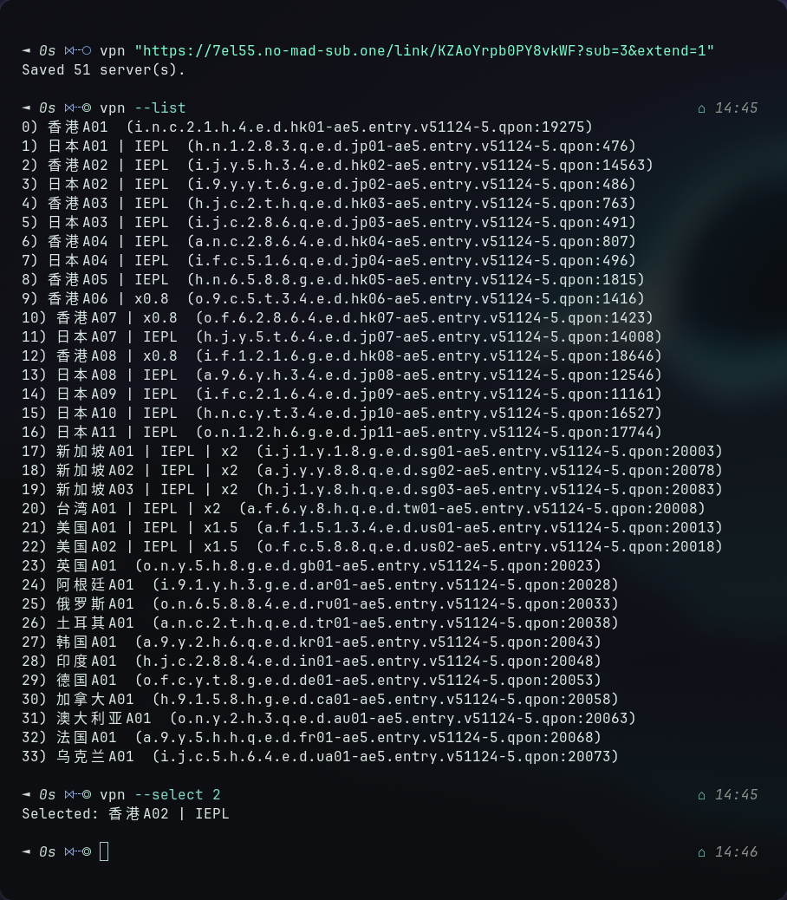
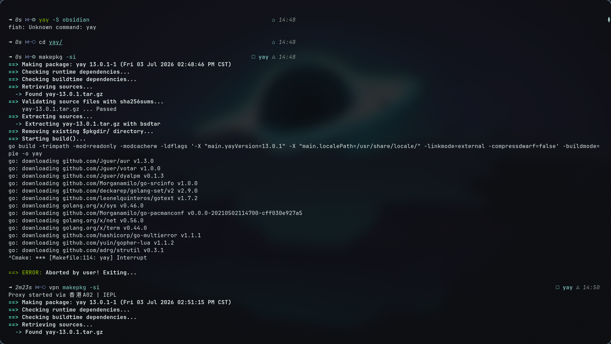

# VPN Command Wrapper

A Python script to solve network issues in China by wrapping any command through a Shadowsocks VPN proxy.

---

## 🎯 Problem

In China, the Great Firewall (GFW) blocks:
- GitHub and AUR access
- Package downloads
- `makepkg -si` gets stuck

**This script fixes it.**

---

## 📦 Quick Install

```bash
# Step 1: Install dependencies
sudo pacman -S shadowsocks-rust python3 curl

# Step 2: Download the script
sudo curl -o /usr/local/bin/vpn https://raw.githubusercontent.com/hishamcyber/vpn-command/main/vpn

# Step 3: Make it executable
sudo chmod +x /usr/local/bin/vpn

# Step 4: Verify installation
vpn

# Step 5: Save your subscription
vpn "https://your-subscription-link-here"

# Step 6: Find the fastest server
vpn --fastest

# Step 7: Start using it!
vpn yay -S google-chrome
```

Now use `vpn` as a command:
```bash
vpn "https://your-subscription-link"
vpn --fastest
vpn yay -S google-chrome
```

---

## 🚀 Commands

| Command | Description |
|---------|-------------|
| `vpn "https://..."` | Save subscription servers |
| `vpn --list` | Show all servers |
| `vpn --test` | Test server speeds |
| `vpn --fastest` | Auto-select fastest server |
| `vpn --select 3` | Manually pick server #3 |
| `vpn <command>` | Run any command through VPN |

---

## 📝 Examples

### Install AUR Package
```bash
# Without VPN (fails in China)
git clone https://aur.archlinux.org/yay.git
cd yay
makepkg -si  # ❌ Stuck!

# With VPN (works)
vpn git clone https://aur.archlinux.org/yay.git
cd yay
vpn makepkg -si  # ✅ Success!
```

### Install Official Package
```bash
vpn sudo pacman -S v2raya
```

### Clone Repository
```bash
vpn git clone https://github.com/hishamcyber/finpal.git
```

### Check Your IP
```bash
vpn curl ifconfig.me  # Shows VPN IP
```

---

## ⚙️ How It Works

- Starts `sslocal` (Shadowsocks client) on `127.0.0.1:1080`
- Sets `http_proxy`, `https_proxy`, `all_proxy` environment variables
- Runs your command through the SOCKS5 proxy
- Proxy stops when command finishes

---

## 📁 Config Files

All stored in `~/.config/vpnrun/`:

| File | Purpose |
|------|---------|
| `nodes.txt` | All saved servers |
| `selected.txt` | Currently selected server |
| `sslocal.pid` | Proxy process ID |

---

## 📋 Dependencies

```bash
sudo pacman -S shadowsocks-rust python3
```

---

## ❓ FAQ

**Q: How do I get a subscription link?**  
A: Sign up with a Shadowsocks provider.

**Q: Why use `-bin` packages?**  
A: Pre-compiled binaries install faster and more reliably.

**Q: Can I use this for other distros?**  
A: Yes, but `pacman` commands are Arch-specific.

---

## 📷 Screenshots

### Listing and Selecting Servers


### Installing yay Through VPN


---

## 📄 License

MIT License

---

**Made for Arch Linux users in China.** 🇨🇳

